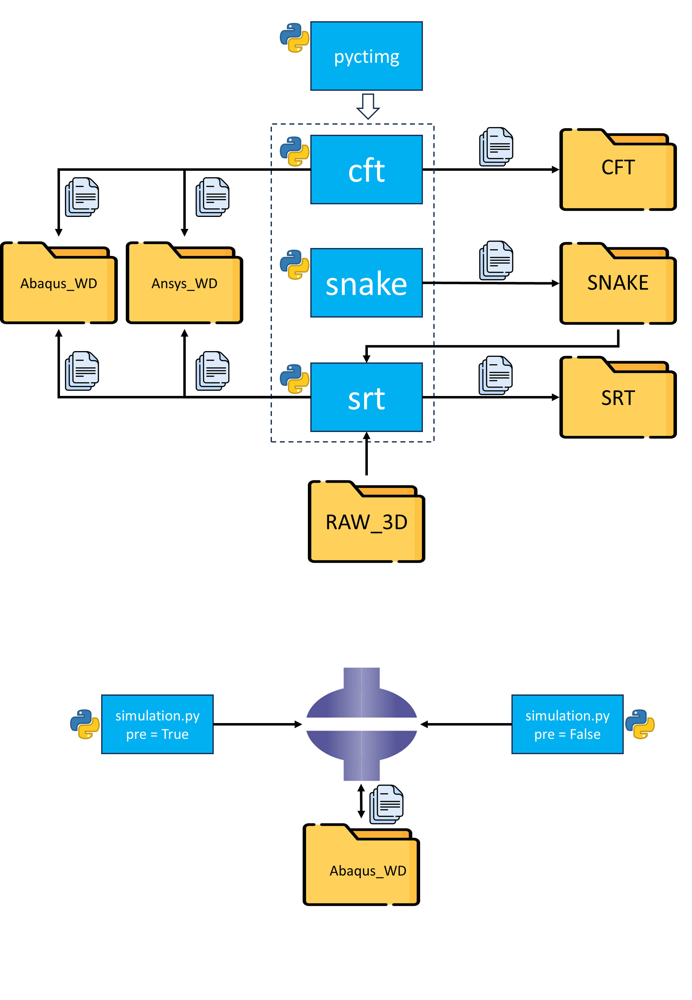

## Project

This repository contains the codes for our paper:  
Fast Automated Creation of Digital Twins for Virtual Mechanical Testing of Ovine Fractured Tibia  
published open access in Computers in Biology and Medicine (CIBM):  
https://doi.org/10.1016/j.compbiomed.2025.110268  
If you use these codes in your research, please cite the paper.

## Workflow

  
- pyctimg.py is a library that needs to be imported in the other codes and must be located in the same directory as them. It consists of class and function definitions.  
- cft.py implements the Contour-Free Technique. For each sample, it loads a 3D input image and stores a .cdb and a .txt in Ansys_WD directory, and a .inp in Abaqus_WD directory. The variables generated through this process along with the runtime are stored in CFT/{sample}.  
- snake.py implements the Snake model. For each sample, it receives an input image as a 3D array and stores the 3D contours, other variables generated through the process, and the runtime in SNAKE/{sample}.  
- srt.py implements the Snake-Reliant Technique. For each sample, it loads a 3D input image along with its 3D contour and stores a .cdb and a .txt in Ansys_WD, and a .inp in Abaqus_WD directory. The variables generated through this process along with the runtime are stored in SRT/{sample}.
- simulation.py is run inside Abaqus CAE from/Run Script for pre-processing and post-processing the simulation. 
	-- pre == True: loads a .inp from Abaqus_WD directory to set up the model, produce a .sh and a new .inp. At this point, finite element model can be solved, outputting a .odb in Abaqus_WD
	-- pre == False: loads the .odb from Abaqus_WD directory and outputs the VTR in a .txt.

Note About Automated Simulations in Abaqus:  
	- Work Directory should be set as Abaqus_WD from/Set Work Directory.
	- .sh is not necessary for running the simulation locally, but it is useful for running the simulation on a high-performance cluster (HPC).

Note About Array Naming  
	- The first two letters in the name of an array indicate its dimensionality:  
&nbsp;vc: vector; mx: matrix; tn: 3rd-order tensor  
For example, "tnj" is a 3D array representing the 3rd-order tensor J.

## Author

**Alireza Ariyanfar**  
[GitHub](https://github.com/AlirezaAr222) | [LinkedIn](https://www.linkedin.com/in/alireza-ariyanfar/)
